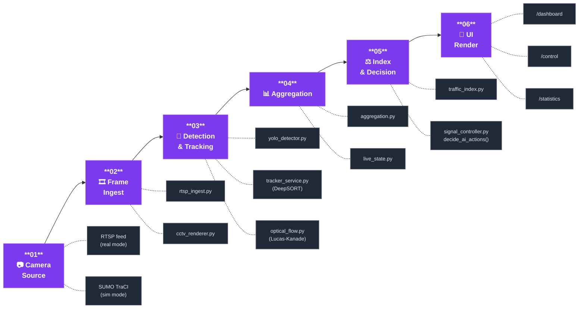

# 🏗️ TraffixFlow — Architecture Diagrams

แผนภาพการทำงานของระบบ **TraffixFlow Pathumwan** (Hybrid Real-Time + Simulation Traffic Analytics) แบ่งเป็น 4 มุมเพื่ออธิบายระบบครอบคลุมตั้งแต่ภาพรวมจนถึงการทำงานของ background threads

> Mermaid blocks ด้านล่าง render ได้ทั้งบน **GitHub** และ **VS Code Markdown Preview** โดยตรง ไม่ต้องใช้เครื่องมือภายนอก

---

## 1️⃣ High-Level System Overview

ภาพรวมระบบ 4 บล็อกหลัก แสดงความสัมพันธ์แบบ macro ระหว่าง UI / API / AI Engine / Data Store

```mermaid
flowchart LR
    subgraph UI["🖥️ User Interface — Next.js 16 / React 19"]
        direction TB
        D[Dashboard]
        C[Control]
        S[Statistics]
        CAM[Cameras]
        DEN[Density]
    end

    subgraph API["🌐 Backend API — Flask + SQLAlchemy"]
        direction TB
        AUTH[/api/auth/]
        TRAF[/api/traffic/*/]
        CAMR[/api/cameras/*/]
        STAT[/api/stats/*/]
        ADM[/api/admin/*/]
    end

    subgraph ENGINE["🧠 AI / Simulation Engine"]
        direction TB
        YOLO[YOLOv12n + DeepSORT]
        FLOW[Lucas-Kanade Optical Flow]
        SUMO[SUMO TraCI Simulation]
        SIG[Signal Controller / AI]
    end

    subgraph DATA["💾 Data Store"]
        direction TB
        DB[(PostgreSQL / SQLite<br/>16 Tables)]
        STATIC[Static Data:<br/>osm.net.xml<br/>pathumwan_roads.json<br/>pathumwan_traffic_profile.json]
    end

    EXT[(📡 RTSP Streams<br/>or<br/>SUMO Sim)]

    UI <-->|REST / MJPEG| API
    API <-->|threads| ENGINE
    ENGINE <-->|TraCI / RTSP| EXT
    ENGINE -->|writes metrics| DATA
    API <-->|read/write| DATA

    classDef ui fill:#1e3a8a,stroke:#3b82f6,color:#fff
    classDef api fill:#065f46,stroke:#10b981,color:#fff
    classDef engine fill:#7c2d12,stroke:#f97316,color:#fff
    classDef data fill:#581c87,stroke:#a855f7,color:#fff
    class UI ui
    class API api
    class ENGINE engine
    class DATA data
```

**สรุป**: ผู้ใช้คุยกับ Frontend → Frontend ยิง REST ไปที่ Flask API → API อ่าน/เขียน Database และสั่ง Engine → Engine ดึง frame จากกล้องจริงหรือ SUMO แล้วประมวลผล

---

## 2️⃣ Pipeline Flow — เส้นทางของ 1 Frame

แนวนอน 6 ขั้น แสดง data flow ตั้งแต่กล้องเข้าจนถึงหน้าจอผู้ใช้

**Hot-path**: 1 frame ใช้เวลา ~6-8 ms บน T4 GPU (YOLO inference) + ~2 ms (DeepSORT) + ~3 ms (Optical Flow) ≈ **~13 ms ต่อกล้อง** ที่ 2 Hz × 55 cams ≈ ~110 fps load

---

## 3️⃣ Layered Component Map

แผนภาพละเอียดแบ่งตาม layer แสดงไฟล์จริงในโปรเจค

```mermaid
flowchart TB
    subgraph FE_PAGE["Frontend Pages (frontend-next/src/app/)"]
        direction LR
        FP1[dashboard]
        FP2[control]
        FP3[statistics]
        FP4[cameras]
        FP5[density]
        FP6[admin]
        FP7[login / register / profile]
    end

    subgraph FE_COMP["Frontend Components (frontend-next/src/components/)"]
        direction LR
        FC1[CctvFeed]
        FC2[MapView]
        FC3[CctvMiniMap]
        FC4[Navbar]
        FC5[ProtectedRoute]
    end

    subgraph ROUTE["API Routes (backend/routes/)"]
        direction LR
        R1[auth.py]
        R2[traffic.py]
        R3[cameras.py]
        R4[stats.py]
        R5[admin.py]
    end

    subgraph SVC["Services (backend/services/)"]
        direction LR
        SV1[signal_controller]
        SV2[aggregation]
        SV3[density]
        SV4[traffic_index]
        SV5[live_state]
        SV6[optical_flow]
        SV7[rtsp_ingest]
        SV8[daily_stats]
        SV9[camera_sync]
        SV10[camera_runtime]
        SV11[mapping]
        SV12[auth_service]
        SV13[ai_logger]
        SV14[replay]
    end

    subgraph AI_SIM["Detection / Simulation"]
        direction LR
        AS1[detection/yolo_detector.py<br/>YOLOv12n]
        AS2[detection/detector_service.py]
        AS3[detection/tracker_service.py<br/>DeepSORT]
        AS4[simulation.py<br/>SUMO TraCI]
        AS5[cctv_renderer.py<br/>headless render]
    end

    subgraph DATA_LAYER["Data Layer"]
        direction LR
        DL1[(16 SQLAlchemy<br/>Tables)]
        DL2[osm.net.xml<br/>SUMO network]
        DL3[pathumwan_roads.json]
        DL4[pathumwan_traffic_profile.json]
        DL5[camera_runtime_config<br/>.generated.json]
    end

    FE_PAGE --> FE_COMP
    FE_COMP -->|fetch JSON / MJPEG| ROUTE
    ROUTE --> SVC
    SVC --> AI_SIM
    SVC --> DATA_LAYER
    AI_SIM --> DATA_LAYER

    classDef fe fill:#1e3a8a,stroke:#60a5fa,color:#fff
    classDef route fill:#065f46,stroke:#34d399,color:#fff
    classDef svc fill:#7c2d12,stroke:#fb923c,color:#fff
    classDef ai fill:#9f1239,stroke:#fb7185,color:#fff
    classDef data fill:#581c87,stroke:#c084fc,color:#fff
    class FE_PAGE,FE_COMP fe
    class ROUTE route
    class SVC svc
    class AI_SIM ai
    class DATA_LAYER data
```

### 16 Tables ใน Database Layer
`users`, `cameras`, `roads`, `junctions`, `approaches`, `traffic_detections`, `traffic_index`, `road_density`, `signal_timings`, `signal_controllers`, `signal_states`, `ai_decisions`, `historical_stats`, `system_logs`, `hourly_vehicle_counts`, `runtime_config`

> ดู ER diagram และ column definitions ที่ [DB_DIAGRAM.md](./DB_DIAGRAM.md) และ [DB_TABLES_REFERENCE.md](./DB_TABLES_REFERENCE.md)

---

## 4️⃣ Background Thread Topology

`backend/app.py` สตาร์ท threads ตาม `Config.SYSTEM_MODE` (`real` / `sim`) — ดู `_background_thread_specs()` ที่ [backend/app.py:371-395](backend/app.py#L371-L395)

```mermaid
flowchart TB
    BOOT["bootstrap_app()<br/>↓<br/>_start_background_threads()"]

    subgraph SIM_M["🚦 Sim Mode Threads (SYSTEM_MODE=sim)"]
        direction TB
        ST1["Simulation<br/>simulation.simulation_loop()"]
        ST2["Camera Capture<br/>simulation.camera_capture_loop()"]
        ST3["Detection<br/>detector_service.start_detection_loop()"]
        ST4["Signal Apply<br/>2 s cadence • AI 5 s"]
    end

    subgraph REAL_M["📡 Real Mode Threads (SYSTEM_MODE=real)"]
        direction TB
        RT1["RTSP Ingest<br/>rtsp_ingest.start_rtsp_ingest_loop()"]
        RT2["Optical Flow<br/>2 fps • CPU ~20%"]
        RT3["Tracker<br/>tracker_service.start_tracker_service_loop()"]
    end

    subgraph ALWAYS["⏱️ Always-On Threads"]
        direction TB
        AT1["Index Calc<br/>INDEX_INTERVAL"]
        AT2["Aggregation<br/>30 s default"]
        AT3["Daily Stats<br/>hourly rollup + retention"]
    end

    BOOT --> SIM_M
    BOOT --> REAL_M
    BOOT --> ALWAYS

    ST3 -.->|writes| DBX[(traffic_detections)]
    RT3 -.->|writes| DBX
    AT1 -.->|reads/writes| DBX
    AT1 -.->|writes| TIDX[(traffic_index<br/>road_density)]
    AT2 -.->|writes| HVC[(hourly_vehicle_counts)]
    AT3 -.->|writes| HIST[(historical_stats)]
    ST4 -.->|reads| ST[(signal_timings)]
    ST4 -.->|writes via TraCI| SUMOX[SUMO TLS]

    classDef boot fill:#0f172a,stroke:#f59e0b,color:#fbbf24,font-weight:bold
    classDef sim fill:#7c2d12,stroke:#fb923c,color:#fff
    classDef real fill:#065f46,stroke:#34d399,color:#fff
    classDef always fill:#1e3a8a,stroke:#60a5fa,color:#fff
    classDef db fill:#581c87,stroke:#c084fc,color:#fff
    class BOOT boot
    class SIM_M sim
    class REAL_M real
    class ALWAYS always
    class DBX,TIDX,HVC,HIST,ST,SUMOX db
```

### Thread cadence (อ้างอิงจากไฟล์จริง)

| Thread | Cadence | Source |
|---|---|---|
| Signal Apply (re-assert manual) | 2 s | [backend/app.py:502](backend/app.py#L502) (`POLL_INTERVAL`) |
| AI decision tick | 5 s | [backend/app.py:503](backend/app.py#L503) (`AI_DECISION_INTERVAL`) |
| Manual override TTL | 600 s | [backend/app.py:501](backend/app.py#L501) (`TTL_SECONDS`) |
| Optical Flow worker | 2 fps | env `OPTICAL_FLOW_FPS_TARGET` |
| Camera capture | 4 fps | env `CAMERA_RENDER_FPS` |
| Aggregation | 30 s | env `AGGREGATION_INTERVAL` |
| Index calculation | `INDEX_INTERVAL` | `Config.INDEX_INTERVAL` |

---

## 📚 อ้างอิงเพิ่มเติม

- [README.md](./README.md) — quick start, env vars, troubleshooting
- [PLAN.md](./PLAN.md) — roadmap & implementation status
- [DB_DIAGRAM.md](./DB_DIAGRAM.md) — ER diagram ของ 16 tables
- [DB_TABLES_REFERENCE.md](./DB_TABLES_REFERENCE.md) — column definitions
- [RUNTIME_CAMERA_OPERATIONS.md](./RUNTIME_CAMERA_OPERATIONS.md) — camera runtime ops
