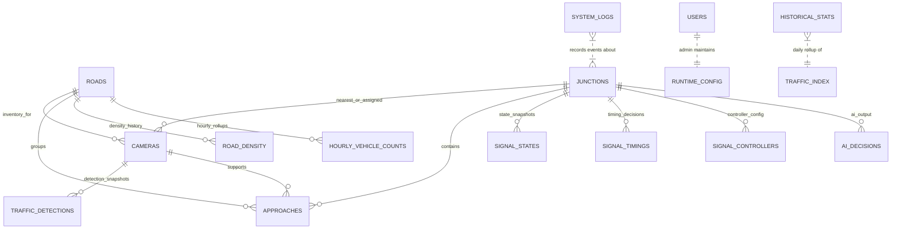

# Database Diagram Overview — TraffixFlow (Pathumwan)

> **Database engine:** Neon PostgreSQL (serverless Postgres) in production.
> SQLite is used only as a local dev fallback when `DATABASE_URI` is not set.
> Source of truth for the schema is [`backend/database/models.py`](backend/database/models.py).
> Column-level reference lives in [`DB_TABLES_REFERENCE.md`](DB_TABLES_REFERENCE.md).

## Current Scope

- The persisted backend schema has **16 real tables**.
- `CameraStream`, `CameraCalibration`, `CameraZone` are **Python aliases** for `Camera` — they do **not** create separate database tables. All streaming, calibration, and zone columns live on `cameras`.
- `LiveVehicleTrack` and `LiveApproachMetric` are intentionally set to `None` in code. Tracker state (per-frame vehicle tracks and per-approach metrics) is kept **in-memory only** and never persisted frame-by-frame.
- There is no `live_vehicle_tracks`, `live_approach_metrics`, `camera_streams`, `camera_calibrations`, or `camera_zones` table on disk.

## Table Inventory (16 tables)

Grouped by purpose:

| Group | Tables |
|---|---|
| Identity & access | `users` |
| Runtime config | `runtime_config` |
| Network topology | `roads`, `junctions`, `approaches` |
| Camera inventory (+ stream, calibration, zones on the same row) | `cameras` |
| Real-time / near-real-time measurements | `traffic_detections`, `road_density`, `traffic_index`, `hourly_vehicle_counts` |
| Signal control & AI reasoning | `signal_states`, `signal_timings`, `signal_controllers`, `ai_decisions` |
| Historical summary & diagnostics | `historical_stats`, `system_logs` |

## Retention Policy

Per-table TTLs are enforced by `backend/services/daily_stats.py::purge_old_raw_data()`,
which runs inside the daily stats background thread (hourly tick). See
`RETENTION_DAYS` in that file for the live values.

| Table | Retention | Reason |
|---|---|---|
| `traffic_detections` | **7 days** | Highest-volume table — one row per camera every `DETECTION_INTERVAL` seconds × 55 cameras. |
| `traffic_index` | 30 days | Keeps ~1 month of area-level index snapshots for trend charts. |
| `road_density` | 30 days | Per-road density / speed history. |
| `signal_states` | 30 days | Raw TLS phase snapshots — useful for short-term debugging of AI actions. |
| `system_logs` | 30 days | Backend event log. Keep long enough to audit incidents but not forever. |
| `ai_decisions` | 30 days | RL audit trail. Extend if you need longer model post-mortems. |
| `hourly_vehicle_counts` | **kept** | Already bounded (roads × hours per day). Powers long-term stats. |
| `historical_stats` | **kept** | One row per day — the permanent record used by the statistics page. |
| `users`, `runtime_config`, `roads`, `junctions`, `approaches`, `cameras`, `signal_timings`, `signal_controllers` | **kept** | Configuration / identity — not append-only time-series. |

> When adjusting a retention window, update both `RETENTION_DAYS` in
> `daily_stats.py` and the table above so they stay in sync.

## How Data Moves Across The Schema

```
                ┌──────────────┐    ┌──────────────┐
                │   roads      │    │  junctions   │
                └──────┬───────┘    └──────┬───────┘
                       │                   │
                       └──────┬────────────┘
                              ▼
                       ┌──────────────┐
                       │   cameras    │ (with calibration + zones inline)
                       └──────┬───────┘
                              │
       ┌──────────────────────┼─────────────────────────┐
       ▼                      ▼                         ▼
┌──────────────┐      ┌──────────────┐         ┌──────────────────┐
│ approaches   │      │  traffic_    │         │  SUMO / YOLO     │
│ (j × road)   │      │  detections  │◀────────│  per 5 s tick    │
└──────┬───────┘      └──────┬───────┘         └──────────────────┘
       │                     │
       │                     ▼
       │             ┌──────────────┐       ┌──────────────────────┐
       │             │ road_density │──────▶│ hourly_vehicle_counts │
       │             └──────┬───────┘       └──────────┬───────────┘
       │                    ▼                          │
       │             ┌──────────────┐                  │
       │             │ traffic_index│                  │
       │             └──────┬───────┘                  │
       │                    │                          │
       │                    └────┬─────────────────────┘
       │                         ▼
       │                  ┌──────────────────┐
       │                  │ historical_stats │  (once per day)
       │                  └──────────────────┘
       ▼
┌──────────────┐      ┌──────────────┐      ┌──────────────┐
│ signal_      │─────▶│ signal_      │◀─────│ ai_decisions │
│ controllers  │      │ timings      │      └──────┬───────┘
└──────────────┘      └──────┬───────┘             │
                             │                      │
                             ▼                      ▼
                      ┌──────────────┐      ┌──────────────┐
                      │ signal_      │      │ system_logs  │
                      │ states       │      └──────────────┘
                      └──────────────┘
```

1. `roads` and `junctions` define the monitored topology.
2. `cameras` anchors a camera to a road and/or junction, and also stores stream settings, calibration, and zone definitions inline.
3. `approaches` maps each junction approach to a road and (optionally) the camera watching it.
4. `traffic_detections` stores per-camera snapshots produced by YOLO (or the SUMO fallback) every `DETECTION_INTERVAL` seconds.
5. `road_density` and `hourly_vehicle_counts` aggregate those detections (merged with SUMO-derived values) per road.
6. `traffic_index` stores area-level snapshots with a JSON payload summarising multiple roads in a single row.
7. `signal_states`, `signal_timings`, `signal_controllers`, and `ai_decisions` capture control state, chosen timings, and AI reasoning per junction. The new signal-apply background thread reads the latest `signal_timings` row per junction and applies it to SUMO via TraCI.
8. `historical_stats` rolls daily summaries forward for the statistics page, while `system_logs` captures backend events and diagnostics.

## Relationship Summary

- One `road` can relate to many `cameras`, `approaches`, `road_density`, and `hourly_vehicle_counts` rows.
- One `junction` can relate to many `cameras`, `approaches`, `signal_states`, `signal_timings`, `signal_controllers`, and `ai_decisions` rows.
- One `camera` can generate many `traffic_detections` rows and can be referenced by many `approaches` rows.
- `traffic_index` is area-scoped and stores multi-road context inside the `roads` JSON column rather than a separate join table.
- `runtime_config` is intentionally standalone — application settings, not topology.
- `historical_stats` and `system_logs` are append-oriented reporting tables and do not own topology relationships.

## Legacy / Removed Persistence

- ❌ No dedicated `live_vehicle_tracks` table — live tracker state is memory-only.
- ❌ No dedicated `live_approach_metrics` table — per-approach metrics are memory-only.
- ❌ No separate `camera_streams`, `camera_calibrations`, or `camera_zones` tables — merged into `cameras`.

## Editable Diagram Sources

- Mermaid source: [`DB_DIAGRAM.mmd`](DB_DIAGRAM.mmd)
- dbdiagram.io source: [`DB_DIAGRAM.dbml`](DB_DIAGRAM.dbml)
- Full column-level reference (+ CREATE TABLE DDL + JSON schemas): [`DB_TABLES_REFERENCE.md`](DB_TABLES_REFERENCE.md)

## Entity-Relationship Diagram (Mermaid)


