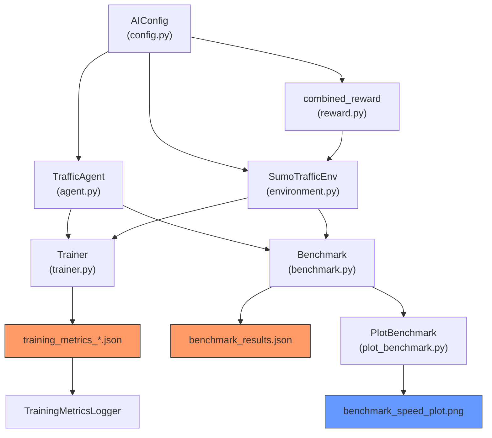

# 📊 การวิเคราะห์พารามิเตอร์การเทรนโมเดลและ Benchmark

## สรุปภาพรวมระบบ

ระบบเป็น **Traffic Signal RL (Reinforcement Learning)** สำหรับควบคุมสัญญาณไฟจราจรเขตปทุมวัน โดยใช้ SUMO simulation พร้อมข้อมูลจราจรจริง

---

## 1. พารามิเตอร์ที่เก็บอยู่แล้ว (ปัจจุบัน)

### 1.1 Hyperparameters (ใน [config.py](file:///d:/src/Traffic-Flow-1/Pathumwan/backend/ai/config.py))

| พารามิเตอร์ | ค่า | คำอธิบาย |
|---|---|---|
| `ALGORITHM` | PPO | อัลกอริทึมหลัก (รองรับ PPO, DQN, A2C, RULE_BASED, FIXED_TIME) |
| `LEARNING_RATE` | 3e-4 | อัตราการเรียนรู้ |
| `GAMMA` | 0.99 | Discount factor |
| `GAE_LAMBDA` | 0.95 | Generalized Advantage Estimation |
| `CLIP_RANGE` | 0.2 | PPO clipping range |
| `N_STEPS` | 2048 | Steps ต่อ update |
| `BATCH_SIZE` | 256 | ขนาด batch |
| `N_EPOCHS` | 10 | จำนวน epochs ต่อ update |
| `ENTROPY_COEF` | 0.02 | Entropy coefficient (exploration) |
| `MAX_GRAD_NORM` | 0.5 | Gradient clipping |
| `VF_COEF` | 0.5 | Value function coefficient |

### 1.2 Environment Parameters

| พารามิเตอร์ | ค่า | คำอธิบาย |
|---|---|---|
| `SIM_STEP_LENGTH` | 1.0s | ความละเอียดการจำลอง |
| `ACTION_INTERVAL` | 10 steps | ระยะห่างระหว่าง AI decision |
| `MAX_EPISODE_STEPS` | 3,600 | ความยาว 1 episode (1 ชม.) |
| `YELLOW_TIME` | 3s | ระยะเวลาไฟเหลือง |
| `MIN_GREEN_TIME` | 10s | เวลาเขียวขั้นต่ำ |
| `MAX_GREEN_TIME` | 60s | เวลาเขียวสูงสุด |
| `FIXED_GREEN_TIME` | 30s | เวลาเขียวคงที่ (baseline) |

### 1.3 State Features (7 features ต่อ junction)

ดูได้ที่ [config.py:L27-L35](file:///d:/src/Traffic-Flow-1/Pathumwan/backend/ai/config.py#L27-L35):

| Feature | คำอธิบาย |
|---|---|
| `queue_length` | จำนวนรถรอที่ไฟแดง |
| `waiting_time` | เวลารอสะสม |
| `vehicle_count` | จำนวนรถบน lane เข้า |
| `avg_speed` | ความเร็วเฉลี่ย |
| `current_phase` | เฟสสัญญาณปัจจุบัน |
| `phase_duration` | เวลาที่เฟสปัจจุบันทำงาน |
| `time_of_day` | เวลาของวัน (normalized) |

### 1.4 Reward Weights (ใน [config.py:L49-L56](file:///d:/src/Traffic-Flow-1/Pathumwan/backend/ai/config.py#L49-L56))

| Component | น้ำหนัก | ทิศทาง | หมายเหตุ |
|---|---|---|---|
| `waiting_time` | -0.4 | ลงโทษ | `min(total_wait / 300, 1.0)` |
| `throughput` | +1.0 | ให้รางวัล | `min(arrived / 10, 1.0)` |
| `avg_speed` | +0.3 | ให้รางวัล | `min(avg / 13.89, 1.0)` → 50 km/h = max |
| `queue_length` | -0.3 | ลงโทษ | `min(queue / (50 × n_junctions), 1.0)` |
| `phase_switch` | -0.1 | ลงโทษ | การเปลี่ยนเฟสบ่อยเกินไป |
| `emergency_penalty` | -2.0 | ลงโทษ | รถรอเกิน 120 วินาที |

### 1.5 Training Settings

| พารามิเตอร์ | ค่า | คำอธิบาย |
|---|---|---|
| `TOTAL_TIMESTEPS` | 500,000 | จำนวน timestep เป้าหมาย |
| `EVAL_FREQ` | 10,000 | ความถี่ evaluation |
| `SAVE_FREQ` | 50,000 | ความถี่บันทึกโมเดล |

---

## 2. ผลลัพธ์ Benchmark ปัจจุบัน

### จาก [benchmark_results.json](file:///d:/src/Traffic-Flow-1/Pathumwan/data/benchmark_results.json)

| Algorithm | Junctions | Avg Wait Time (s) | Avg Throughput | Avg Reward |
|---|---|---|---|---|
| FIXED_TIME | 10 | 97,028 | 5,569 | 213.18 |
| RULE_BASED | 10 | 94,129 | 5,721 | 238.57 |
| **PPO** | 10 | **86,946** | 5,392 | 239.32 |
| DQN | 10 | 110,623 | 6,534 | 279.53 |
| **A2C** | 10 | 95,076 | **6,678** | **302.96** |

### Training Metrics Summary (จากไฟล์ที่มีอยู่)

| Algorithm | Actual Timesteps | Training Time | Episodes | Improvement % |
|---|---|---|---|---|
| [PPO](file:///d:/src/Traffic-Flow-1/Pathumwan/data/training_metrics_PPO_20260429_171759.json) | 25,000 | 8,186s (~2.3hr) | 96 training + 5 eval | +1.9% |
| [DQN](file:///d:/src/Traffic-Flow-1/Pathumwan/data/training_metrics_DQN_20260502_002017.json) | 50,000 | 83,214s (~23.1hr) | 157 training + 5 eval | +25.4% |
| [A2C](file:///d:/src/Traffic-Flow-1/Pathumwan/data/training_metrics_A2C_20260429_194204.json) | — | — | — | — |

---

## 3. พารามิเตอร์เฉพาะอัลกอริทึม (ใน [agent.py](file:///d:/src/Traffic-Flow-1/Pathumwan/backend/ai/agent.py))

### PPO-specific ([agent.py:L56-L72](file:///d:/src/Traffic-Flow-1/Pathumwan/backend/ai/agent.py#L56-L72))
| พารามิเตอร์ | ค่า |
|---|---|
| Policy | MlpPolicy |
| gae_lambda | 0.95 |
| clip_range | 0.2 |
| n_steps | 2048 |
| n_epochs | 10 |
| vf_coef | 0.5 |
| max_grad_norm | 0.5 |
| device | cpu |

### DQN-specific ([agent.py:L84-L107](file:///d:/src/Traffic-Flow-1/Pathumwan/backend/ai/agent.py#L84-L107))
| พารามิเตอร์ | ค่า |
|---|---|
| Policy | MlpPolicy |
| learning_starts | 1,000 |
| buffer_size | min(50,000, total_ts) |
| exploration_initial_eps | 1.0 |
| exploration_final_eps | 0.05 |
| exploration_fraction | 0.5 |
| target_update_interval | 500 |
| train_freq | 4 |
| gradient_steps | 1 |
| device | cpu |

### A2C-specific ([agent.py:L110-L118](file:///d:/src/Traffic-Flow-1/Pathumwan/backend/ai/agent.py#L110-L118))
| พารามิเตอร์ | ค่า |
|---|---|
| Policy | MlpPolicy |
| learning_rate | 3e-4 |
| gamma | 0.99 |
| device | cpu |

> [!WARNING]
> A2C ใช้ค่าพารามิเตอร์น้อยมาก — ใช้ค่า default ของ SB3 สำหรับ `n_steps`, `ent_coef`, `vf_coef` ฯลฯ ซึ่ง **ไม่ได้ถูกบันทึกลงไฟล์ metrics**

---

## 4. สิ่งที่ขาดหายไป — ไม่ถูกบันทึกสำหรับรายงาน

> [!IMPORTANT]
> ต่อไปนี้คือพารามิเตอร์สำคัญที่ **ไม่ได้ถูกบันทึก** ในไฟล์ training metrics หรือ benchmark results

### 4.1 Training Metrics (`trainer.py`) — ขาดข้อมูลต่อไปนี้

| ข้อมูลที่ขาด | ความสำคัญ | อธิบาย |
|---|---|---|
| ❌ `gae_lambda`, `clip_range`, `max_grad_norm`, `vf_coef` | สูง | PPO-specific params ที่ต้องรายงาน |
| ❌ DQN-specific params ทั้งหมด | สูง | `learning_starts`, `buffer_size`, `exploration_*`, `target_update_interval`, `train_freq` |
| ❌ A2C default params | กลาง | ค่า default ของ SB3 ที่ถูกใช้จริง |
| ❌ Network architecture | สูง | ไม่มีการบันทึก MLP layer sizes (SB3 default = [64, 64]) |
| ❌ Observation space shape | สูง | จำนวน junction × features |
| ❌ Action space shape | สูง | MultiDiscrete dims |
| ❌ Junction IDs | กลาง | ไม่มีบันทึกว่า junction ใดถูกเลือก |
| ❌ SUMO version | กลาง | ควรบันทึกเวอร์ชัน SUMO ที่ใช้ |
| ❌ Python/SB3 version | กลาง | ควรบันทึกสำหรับ reproducibility |
| ❌ Per-step reward breakdown | ต่ำ | แต่ละ component ของ reward |
| ❌ `avg_speed` per episode | สูง | ไม่ถูกบันทึกใน episode record |
| ❌ `queue_length` per episode | สูง | ไม่ถูกบันทึกใน episode record |

### 4.2 Benchmark (`benchmark.py`) — ขาดข้อมูลต่อไปนี้

| ข้อมูลที่ขาด | ความสำคัญ | อธิบาย |
|---|---|---|
| ❌ `std_dev` (ส่วนเบี่ยงเบน) | สูง | ไม่มี SD ของ wait time, throughput, reward |
| ❌ `min`/`max` per metric | สูง | ไม่มี range ของแต่ละ metric |
| ❌ Per-episode detail | กลาง | บันทึกแค่ค่าเฉลี่ย ไม่มีรายละเอียดรายอีกpisode |
| ❌ `avg_speed` | สูง | ไม่มีค่าความเร็วเฉลี่ย |
| ❌ `avg_queue_length` | สูง | ไม่มีค่าคิวเฉลี่ย |
| ❌ Timestamp ของ benchmark | กลาง | ไม่มีเวลาที่ benchmark ถูกรัน |
| ❌ `episodes_per_model` | กลาง | จำนวน episode ที่ใช้ (ปัจจุบัน hardcode = 3) |
| ❌ Reward breakdown per component | สูง | ไม่แยก reward เป็น waiting_time, throughput ฯลฯ |
| ❌ % Improvement vs baseline | สูง | ไม่คำนวณ % ดีขึ้นเทียบกับ FIXED_TIME |

---

## 5. แผนภาพ Data Flow

---

## 6. สรุปไฟล์ที่เกี่ยวข้อง

| ไฟล์ | บทบาท | หมายเหตุ |
|---|---|---|
| [config.py](file:///d:/src/Traffic-Flow-1/Pathumwan/backend/ai/config.py) | กำหนดค่าพารามิเตอร์ทั้งหมด | 64 บรรทัด |
| [agent.py](file:///d:/src/Traffic-Flow-1/Pathumwan/backend/ai/agent.py) | สร้างโมเดล SB3 + rule-based | 327 บรรทัด, algorithm-specific params อยู่ที่นี่ |
| [trainer.py](file:///d:/src/Traffic-Flow-1/Pathumwan/backend/ai/trainer.py) | Training loop + metrics logger | 418 บรรทัด |
| [environment.py](file:///d:/src/Traffic-Flow-1/Pathumwan/backend/ai/environment.py) | Gymnasium env wrapper | 411 บรรทัด |
| [reward.py](file:///d:/src/Traffic-Flow-1/Pathumwan/backend/ai/reward.py) | Reward function components | 132 บรรทัด |
| [benchmark.py](file:///d:/src/Traffic-Flow-1/Pathumwan/backend/ai/benchmark.py) | เปรียบเทียบทุก algorithm | 177 บรรทัด |
| [plot_benchmark.py](file:///d:/src/Traffic-Flow-1/Pathumwan/backend/ai/plot_benchmark.py) | สร้างกราฟ speed comparison | 157 บรรทัด |

---

## 7. คำถามก่อนดำเนินการ

> [!IMPORTANT]
> **กรุณาตอบคำถามต่อไปนี้เพื่อจะได้ปรับปรุงโค้ดตามที่ต้องการ:**

1. **ต้องการเพิ่มพารามิเตอร์อะไรบ้าง?** — ทั้งหมดที่แนะนำในหัวข้อ 4 หรือเลือกเฉพาะบางตัว?
2. **ต้องการ format ผลลัพธ์แบบใด?** — JSON เหมือนเดิม, CSV สำหรับ Excel, หรือทั้งสองอย่าง?
3. **ต้องการ reward breakdown ต่อ component ไหม?** — เช่น แยก waiting_time_reward, throughput_reward, speed_reward ในแต่ละ episode
4. **ต้องการรัน benchmark ใหม่หลังแก้ไขโค้ดไหม?** — หรือแค่เพิ่มโค้ดเก็บข้อมูลสำหรับรอบถัดไป
