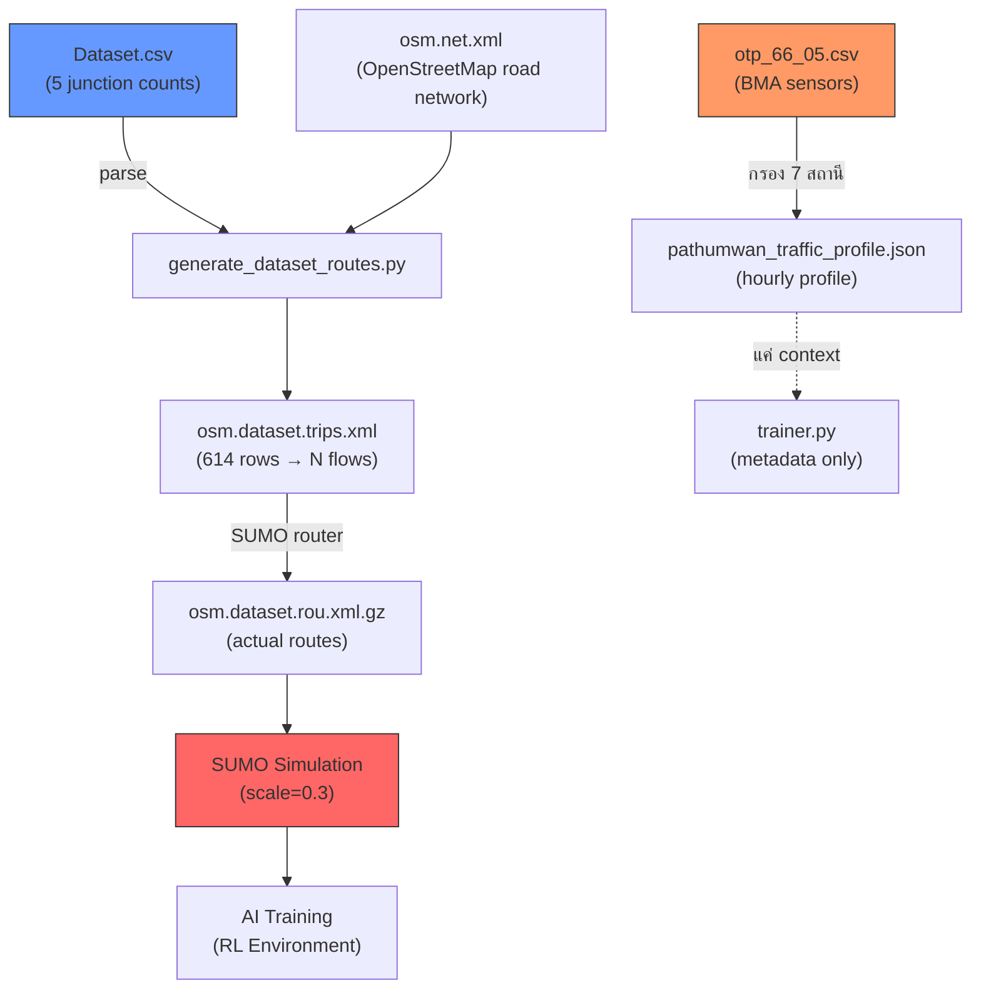

# 📊 การตรวจสอบคุณภาพข้อมูลสำหรับการเทรนโมเดล

## สรุปภาพรวม

ระบบใช้ข้อมูลจาก **4 แหล่ง** ในการสร้าง SUMO simulation สำหรับเทรน RL agent:

| แหล่งข้อมูล | ไฟล์ | ขนาด | บทบาท |
|---|---|---|---|
| BMA Sensor Data | [otp_66_05.csv](file:///d:/src/Traffic-Flow-1/Pathumwan/data/otp_66_05.csv) | 15,776 rows, 2.3 MB | Traffic profile — volume, speed, density |
| Junction Counts | [Dataset.csv](file:///d:/src/Traffic-Flow-1/Pathumwan/data/Dataset.csv) | 614 rows, 155 KB | Per-junction vehicle flows by type |
| Traffic Profile | [pathumwan_traffic_profile.json](file:///d:/src/Traffic-Flow-1/Pathumwan/data/pathumwan_traffic_profile.json) | 24 KB | Aggregated hourly stats from BMA |
| Route Generator | [generate_dataset_routes.py](file:///d:/src/Traffic-Flow-1/Pathumwan/generate_dataset_routes.py) | 556 lines | Converts CSV → SUMO trips |

---

## 1. แหล่งข้อมูล #1: otp_66_05.csv (BMA Sensor Data)

### ข้อมูลที่มี
- **แหล่งที่มา**: กรมทางหลวง (DOH) — ระบบ OTP sensor
- **ช่วงเวลา**: เดือนกันยายน 2022 (วันที่ 5-9 ก.ย. 65) — **วันทำงาน 5 วัน**
- **ชั่วโมง**: 05:00-19:00 (14 ชม./วัน)
- **จำนวน rows**: 15,776 rows
- **คอลัมน์**: name, latitude, longitude, organization, date_type, date, time_start, time_end, speed, density, volume, capacity, v/c

### ✅ จุดแข็ง
- ข้อมูลจริงจาก sensor บนถนน (ไม่ใช่ข้อมูลจำลอง)
- มี speed, density, volume, capacity, V/C ratio ครบถ้วน
- มีพิกัด GPS (lat, lng) สำหรับแต่ละสถานี

### ⚠️ ปัญหาที่พบ

> [!WARNING]
> **ปัญหา #1: สถานีส่วนใหญ่ไม่อยู่ในเขตปทุมวัน**
> 
> ตัวอย่างสถานีแรกๆ ใน CSV:
> - `PER-14-001` พุทธมณฑลสาย 4 (lat 13.777, lng **100.223**) — **นครชัยศรี**
> - `PER-12-016` กระทุ่มล้ม (lat 13.764, lng **100.329**) — **สมุทรสาคร**  
> - `PER-3-004` ถ.เพชรเกษม อ้อมใหญ่ (lat 13.708, lng **100.284**) — **นครปฐม**
>
> พื้นที่ปทุมวัน (bounding box ของ profile): lat 13.72-13.76, lng **100.51-100.56**
> 
> **ข้อมูลเหล่านี้อยู่ห่างจากพื้นที่เป้าหมายหลายสิบกิโลเมตร** จึงไม่สะท้อนสภาพจราจรในเขตปทุมวัน

> [!WARNING]
> **ปัญหา #2: ข้อมูลจำกัดเพียง 5 วัน**
> 
> มีข้อมูลเพียง 5-9 ก.ย. 2022 เท่านั้น ไม่ครอบคลุม:
> - วันหยุดสุดสัปดาห์
> - วันหยุดนักขัตฤกษ์
> - ฤดูกาลต่างๆ (ฝน/ร้อน)
> - สภาพจราจรที่แตกต่างกันในแต่ละสัปดาห์

> [!CAUTION]
> **ปัญหา #3: Speed ผิดปกติ — บางค่าสูงเกินจริง**
> 
> พบ speed = 129 km/h ในบาง row (สถานีพุทธมณฑลสาย 4) ซึ่งเป็นไปได้สำหรับทางหลวง แต่ **ค่านี้ไม่ควรถูกนำมาใช้กับถนนในเมือง** ที่มี speed limit 60-80 km/h

---

## 2. แหล่งข้อมูล #2: Dataset.csv (Junction-Level Flows)

### ข้อมูลที่มี
- **แหล่งที่มา**: PDF จากการสำรวจจราจร (ข้อมูลจาก_PDF)
- **จำนวน rows**: 614 rows
- **ทางแยก**: 5 แยก (PTW-01 ถึง PTW-05)
- **ประเภทรถ**: 12 ประเภท (จักรยาน, มอเตอร์ไซค์, ตุ๊กตุ๊ก, รถยนต์, แท็กซี่, ตู้, รถโดยสาร, รถบรรทุก)
- **ช่วงเวลา**: เร่งด่วนเช้า (7-9), นอกเวลาเร่งด่วน (9-15), เร่งด่วนเย็น (15-18)
- **ทิศทาง**: ขาเข้าเท่านั้น

### ✅ จุดแข็ง
- ข้อมูลระดับทางแยก — ตรงกับพื้นที่ปทุมวัน
- แยกประเภทรถละเอียด 12 ประเภท
- มีข้อมูลปริมาณจราจร (คัน/ชม.) ต่อทิศทาง

### ⚠️ ปัญหาที่พบ

> [!WARNING]
> **ปัญหา #4: ครอบคลุมเพียง 5 ทางแยก**
> 
> | รหัส | ชื่อทางแยก |
> |---|---|
> | PTW-01 | แยกปทุมวัน |
> | PTW-02 | แยกราชประสงค์ |
> | PTW-03 | แยกเฉลิมเผ่า |
> | PTW-04 | แยกพงษ์พระราม |
> | PTW-05 | แยกเจริญผล |
> 
> แต่ simulation มี **10 junctions** ที่ถูกควบคุม → **ทางแยกที่เหลือไม่มีข้อมูลจริง**

> [!WARNING]
> **ปัญหา #5: ไม่มีข้อมูลขาออก**
> 
> Dataset.csv มีเฉพาะ "ขาเข้า" — ไม่มีข้อมูล turning ratio (สัดส่วนการเลี้ยว) ที่จำเป็นสำหรับการสร้าง routes ที่สมจริง

> [!NOTE]
> **ปัญหา #6: ไม่ทราบปีของข้อมูล**
> 
> แหล่งที่มาระบุเพียง "ข้อมูลจาก_PDF" — ไม่ทราบว่าเก็บข้อมูลเมื่อใด สภาพจราจรอาจเปลี่ยนแปลงมากแล้ว

---

## 3. แหล่งข้อมูล #3: pathumwan_traffic_profile.json

### ข้อมูลที่มี
- สร้างจาก **otp_66_05.csv** + **opendata-jan_ok.xlsx** (2023)
- สถานี 7 แห่ง (**เฉพาะในเขตปทุมวัน**)
- Hourly profile: 05:00-18:00 (14 ชม.)
- Vehicle proportions: passenger 70.6%, van 23.7%, bus 2%, truck 1%, motorcycle 2.7%

### ✅ จุดแข็ง
- กรองเฉพาะสถานีในเขตปทุมวันแล้ว (7 สถานี)
- มี V/C ratio สำหรับตรวจสอบ congestion level

### ⚠️ ปัญหาที่พบ

> [!WARNING]
> **ปัญหา #7: จำนวน sample น้อยมากในบางสถานี**
> 
> สถานี **TF2-PT-S29-04 (ถ.พระราม1-ราชดำริ)**:
> - ช่วง 05:00 มี **samples = 4**
> - ช่วง 06:00 มี **samples = 3**
> - ช่วง 08:00 มี speed_avg = **0.7 km/h** ← ผิดปกติมาก
> 
> ค่า speed_avg = 0.7 km/h ไม่น่าจะเป็นค่าเฉลี่ยที่ถูกต้อง — น่าจะเป็น sensor error

> [!WARNING]
> **ปัญหา #8: Volume vs Median ต่างกันมากในบางช่วง**
> 
> สถานี TF2-PT-S29-04:
> - ช่วง 06:00: `volume_avg = 431` แต่ `volume_median = 81` → **mean สูงกว่า median 5x** = outlier รุนแรง
> - ช่วง 05:00: `volume_avg = 113` แต่ `volume_median = 27` → **4x difference**
>
> แสดงว่ามี outlier ที่ดึง mean สูงขึ้น — ควรใช้ median แทน mean

---

## 4. SUMO Simulation Configuration

### จาก [osm.sumocfg](file:///d:/src/Traffic-Flow-1/Pathumwan/osm.sumocfg)

> [!CAUTION]
> **ปัญหา #9: Scale Factor = 0.3 (ลดปริมาณจราจรเหลือ 30%)**
> 
> ```xml
> <scale value="0.3"/> <!-- Reduce traffic volume to 30% to prevent gridlock -->
> ```
> 
> หมายความว่า:
> - โมเดลเรียนรู้จากสภาพจราจร **เบากว่าความจริง 70%**
> - Policy ที่เรียนรู้อาจ **ไม่สามารถจัดการ peak hour จริง** ได้
> - Benchmark results ทั้งหมดอยู่ภายใต้เงื่อนไข scale=0.3

> [!NOTE]
> **ปัญหา #10: Simulation period = 07:00-18:00**
> 
> ```xml
> <begin value="25200"/>  <!-- 7:00 AM -->
> <end value="64800"/>    <!-- 6:00 PM -->
> ```
> 
> ครอบคลุมเฉพาะกลางวัน — ไม่มีช่วง 18:00-07:00 (กลางคืน)

---

## 5. AI Inference Log — ปัญหาเพิ่มเติม

จากไฟล์ [ai_inference_log.json](file:///d:/src/Traffic-Flow-1/Pathumwan/data/ai_inference_log.json) ที่คุณเปิดดู:

> [!CAUTION]
> **ปัญหา #11: ค่า avg_speed ผิดปกติมากใน inference**
> 
> | Junction | avg_speed_kmh | สถานะ |
> |---|---|---|
> | 1692045529 | **104.99** | ⛔ ผิดปกติ — ไม่ใช่ทางด่วน |
> | 1692209267 | **100.01** | ⛔ ผิดปกติ |
> | 13167186221 | **79.99** | ⚠️ สูงผิดปกติ |
> | 11854065404 | **60.01** | ⚠️ ขอบเขต |
> | 11304894033 | **50.0** | ✅ สมเหตุสมผล |
> | 10206849027 | **20-25** | ✅ สมเหตุสมผล (ในเมือง) |
> 
> **ค่า speed > 80 km/h ในเขตเมืองเป็นไปไม่ได้** — แสดงว่า junction เหล่านี้อาจ:
> 1. ไม่มีรถผ่านเลย → SUMO return max allowed speed
> 2. อยู่บนถนนใหญ่ที่ speed limit สูง
> 3. ข้อมูลผิดพลาด

> [!CAUTION]
> **ปัญหา #12: PPO ใช้ rule_based method จริงๆ**
> 
> ทุก record ใน inference log แสดง:
> ```json
> "algorithm": "PPO",
> "method": "rule_based"
> ```
> 
> นี่หมายความว่า **PPO model ไม่ได้ถูกโหลด** → fallback เป็น rule-based
> ดังนั้น inference ที่กำลังรันอยู่ **ไม่ได้ใช้ PPO model จริง**

---

## 6. Data Flow — จากข้อมูลดิบ → SUMO Routes



> [!IMPORTANT]
> **Traffic profile (จาก otp_66_05.csv) ไม่ได้ถูกใช้โดยตรงในการเทรน** — มันถูกเก็บแค่เป็น metadata ใน training metrics
> 
> **ข้อมูลที่ใช้จริงในการสร้าง routes คือ Dataset.csv เท่านั้น** — ซึ่งมีเพียง 614 rows จาก 5 ทางแยก

---

## 7. สรุปคะแนนคุณภาพข้อมูล

| เกณฑ์ | คะแนน | ปัญหา |
|---|:---:|---|
| **ความครอบคลุมพื้นที่** | 🟡 5/10 | มีเพียง 5 junction จาก 10 ที่ควบคุม |
| **ความครอบคลุมเวลา** | 🟡 5/10 | เฉพาะ 07:00-18:00, ข้อมูลเพียง 5 วัน |
| **ความถูกต้อง (Accuracy)** | 🟠 4/10 | Speed outliers, sensor errors, otp ไม่ตรงพื้นที่ |
| **ความหลากหลาย (Diversity)** | 🟡 5/10 | 12 ประเภทรถดี แต่ไม่มีวันหยุด/กลางคืน |
| **ปริมาณข้อมูล** | 🟠 4/10 | Dataset.csv เพียง 614 rows |
| **ความสมจริง (Realism)** | 🟠 3/10 | Scale=0.3 ลดปริมาณ 70%, PPO ไม่ได้ถูกโหลด |
| **Reproducibility** | 🟢 7/10 | มี seed=42, version tracking |
| **ความสมบูรณ์ (Completeness)** | 🟡 5/10 | ไม่มีขาออก, ไม่มี turning ratio |
| **รวม** | **🟡 4.75/10** | **ใช้ได้เบื้องต้น แต่มีจุดอ่อนสำคัญ** |

---

## 8. ข้อเสนอแนะสำหรับรายงาน

### ควรระบุในรายงานอย่างชัดเจน (Limitations):
1. ~~**Scale factor 0.3** — โมเดลเทรนด้วยจราจร 30% ของจริง~~ → **แก้ไขแล้ว (scale=1.0)**
2. **ข้อมูลเฉพาะ 5 ทางแยกจาก 10** — junction อื่นใช้ SUMO default
3. **ข้อมูลเฉพาะวันทำงาน** — ไม่มีวันหยุด
4. **ช่วงเวลาเฉพาะ 07:00-18:00** — ไม่มีกลางคืน
5. ~~**PPO ที่ deploy อยู่ fallback เป็น rule-based**~~ → **แก้ไขแล้ว (logging ปรับปรุง + ต้อง re-train)**

### สิ่งที่อ้างอิงได้ (Strengths):
1. ข้อมูลจากหน่วยงานจริง (กรมทางหลวง + BMA)
2. ข้อมูลระดับทางแยกที่เฉพาะเจาะจง (Dataset.csv)
3. แยกประเภทรถ 12 ประเภท — สมจริงกว่าการสุ่ม
4. ใช้ OpenStreetMap road network (osm.net.xml) ที่แม่นยำ
5. มี route generation ที่คำนึงถึง road class compatibility

---

## 9. การแก้ไขที่ดำเนินการแล้ว (2026-05-31)

### ✅ แก้ไขในโค้ดแล้ว

| ปัญหา | สถานะ | ไฟล์ที่แก้ | รายละเอียด |
|---|:---:|---|---|
| #3 Speed สูงเกินจริง | ✅ | `backend/ai/pipeline.py` | Clamp speed ≤ 60 km/h, ถ้าไม่มีรถ → speed = 0 |
| #7 Sample น้อย | ✅ | `data/clean_traffic_profile.py` | Interpolate จากช่วงเวลาข้างเคียงเมื่อ samples < 5 |
| #8 Volume outlier | ✅ | `data/clean_traffic_profile.py` | ใช้ median แทน mean เมื่อ avg/median > 3x |
| #9 Scale = 0.3 | ✅ | `osm.sumocfg` | เปลี่ยนเป็น scale = 1.0, teleport 600s |
| #11 Speed ผิดปกติ inference | ✅ | `backend/ai/pipeline.py` | Urban speed cap + filter empty lanes |
| #12 PPO fallback | ✅ | `backend/ai/predictor.py` | Logging ปรับปรุง + คำแนะนำ re-train |

### 📋 รายการตรวจสอบใหม่

| ไฟล์ | บทบาท |
|---|---|
| `data/pathumwan_traffic_profile.cleaned.json` | ข้อมูลที่ทำความสะอาดแล้ว (16 fixes) |
| `data/pathumwan_traffic_profile.changelog.json` | บันทึกการเปลี่ยนแปลงทั้งหมด |
| `data/clean_traffic_profile.py` | Script ทำความสะอาดข้อมูล (รันซ้ำได้) |
| `data/validate_data.py` | ตรวจสอบคุณภาพก่อนเทรน |

### ⏳ ยังต้องดำเนินการ

1. **Re-train PPO model** ด้วยข้อมูลที่แก้ไขแล้ว + scale=1.0
   ```bash
   cd backend
   python -m ai.trainer --algorithm PPO --timesteps 100000
   ```

### 📝 ข้อจำกัดของข้อมูลต้นทาง (ไม่สามารถแก้ด้วยโค้ด)

| ปัญหา | เหตุผลที่แก้ไม่ได้ |
|---|---|
| #1 สถานี OTP นอกเขตปทุมวัน | ต้องเก็บข้อมูลใหม่จากสถานีในพื้นที่ |
| #2 ข้อมูล 5 วัน | ต้องสำรวจเพิ่มเติม |
| #4 เฉพาะ 5 ทางแยก | ต้องมีข้อมูลทางแยกเพิ่มเติม |
| #5 ไม่มีขาออก | ต้องสำรวจ turning ratio |
| #6 ไม่ทราบปี | ข้อมูลจาก PDF ไม่ระบุ |
| #10 ช่วงเวลาจำกัด | ต้องมีข้อมูลกลางคืน |

